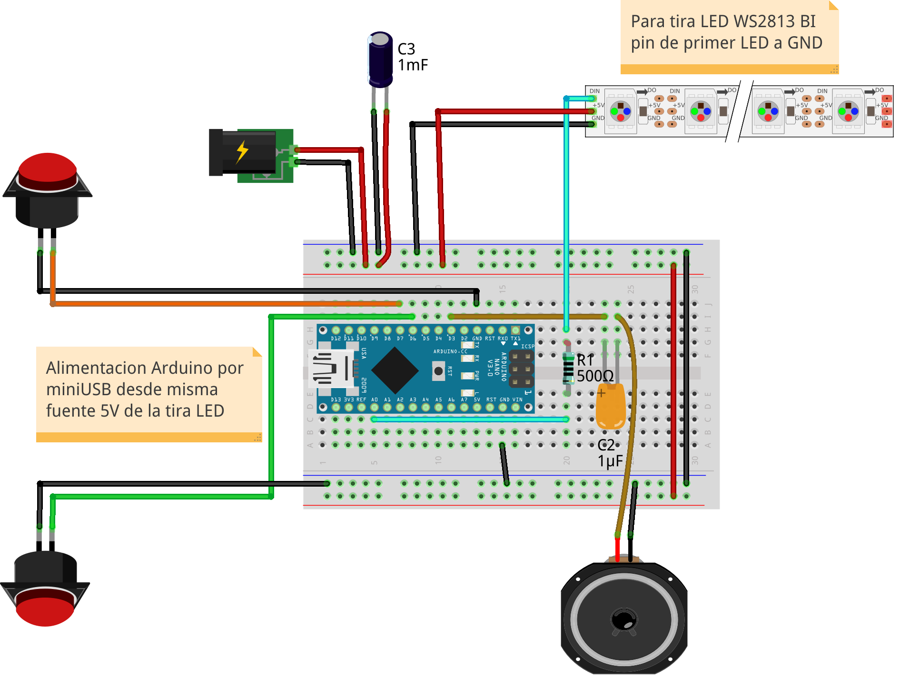

# led-race
Minimalist car race with a strip of LEDs.

# BOM

* 2x [Arcade push button](https://www.aliexpress.com/item/32790898614.html)
* Arduino nano 328p
* [Arduino nano adapter](https://www.aliexpress.com/item/33036220402.html)
* [WS2813 LED strip 5m 60 IP67](https://www.aliexpress.com/item/33023062090.html)
* [Switching Power Supply 5V 3A](https://www.aliexpress.com/item/33012054726.html)
* [RCA male wire 3m](https://www.aliexpress.com/item/32835560337.html)
* [RCA female socket](https://www.aliexpress.com/item/32840529402.html)
* [Capacitor 1000µF 10V](https://www.aliexpress.com/item/1206565956.html)
* [Capacitor 1µF 63V 105J](https://www.aliexpress.com/item/32817169993.html)
* Resistor 330Ω-500Ω
* Speaker 8Ω 0.25W

# Schematic

# 3D

* [Switch grip](https://www.tinkercad.com/things/fRBtnBthecb)
* [Electronic case](https://www.tinkercad.com/things/jmegl8CMt9J)

<iframe width="450" height="280" src="https://www.tinkercad.com/embed/fRBtnBthecb?editbtn=1" frameborder="0" marginwidth="0" marginheight="0" scrolling="no">
</iframe>
 
<iframe width="450" height="280" src="https://www.tinkercad.com/embed/jmegl8CMt9J?editbtn=1" frameborder="0" marginwidth="0" marginheight="0" scrolling="no">
</iframe>
